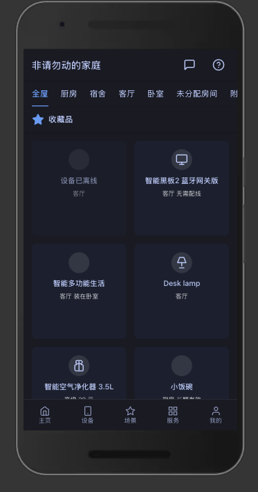
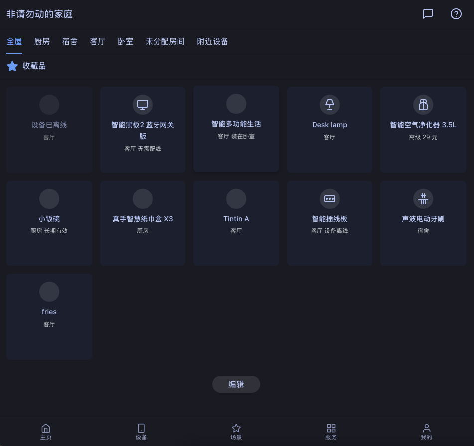

# Qwik Device Management Panel

  

A modern, high-performance web application built with Qwik and Vite for displaying and filtering a list of devices. This project serves as an excellent starting point for building fast and scalable admin panels or monitoring dashboards.

## ✨ Features

-   **Instant Loading**: Built with Qwik for unparalleled initial load performance (Resumability).
-   **Dynamic Filtering**: Client-side filtering logic implemented with custom hooks.
-   **Component-Based Architecture**: Organized and reusable UI components.
-   **Type-Safe Codebase**: Fully written in TypeScript for better maintainability.
-   **Modern Tooling**: Fast development experience powered by Vite and Bun.

## 📸 Preview

| Mobile | Desktop |
| :---: | :---: |
|  |  |

## 🚀 Technology Stack

-   **Framework**: [Qwik](https://qwik.dev/)
-   **Build Tool**: [Vite](https://vitejs.dev/)
-   **Language**: [TypeScript](https://www.typescriptlang.org/)
-   **Package Manager**: [Bun](https://bun.sh/) (or npm/pnpm/yarn)
-   **Styling**: Plain CSS

## 📂 Project Structure

```
/
├── public/              # Static assets
├── src/
│   ├── assets/          # Component-specific assets
│   ├── components/      # Reusable Qwik components (e.g., DeviceCard)
│   ├── hooks/           # Custom hooks (e.g., useFilteredDevices)
│   ├── app.tsx          # Main application component
│   └── main.tsx         # Application entry point
├── package.json         # Project dependencies and scripts
├── vite.config.ts       # Vite configuration
└── tsconfig.json        # TypeScript configuration
```

## ⚡️ Getting Started

### 1. Prerequisites

Make sure you have [Bun](https://bun.sh/docs/installation), [Node.js](https://nodejs.org/) (v18+), or [pnpm](https://pnpm.io/) installed.

### 2. Installation

Clone the repository and install the dependencies:

```bash
git clone <repository-url>
cd qwik-ts
bun install
# or: npm install
# or: pnpm install
```

### 3. Available Scripts

In the project directory, you can run:

| Script        | Description                                             |
|---------------|---------------------------------------------------------|
| `bun run dev` | Runs the app in development mode at `http://localhost:5173`. |
| `bun run build` | Builds the app for production to the `dist` folder.     |
| `bun run preview`| Serves the production build locally for preview.        |